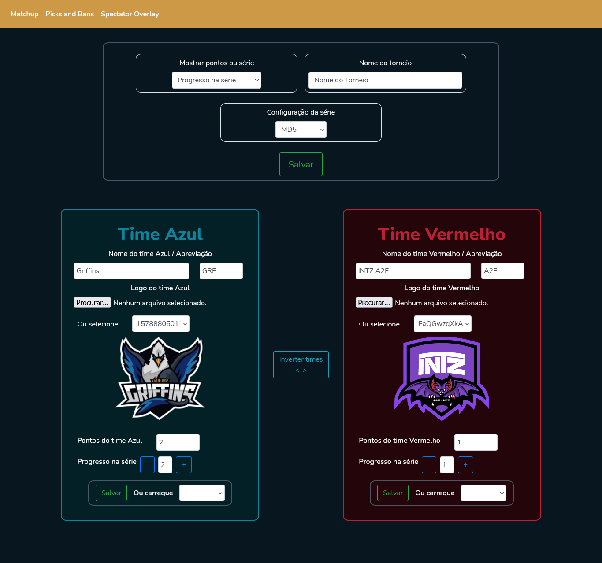
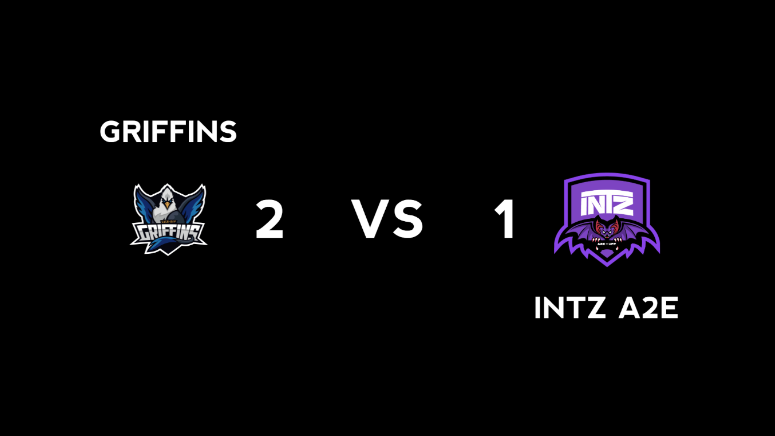
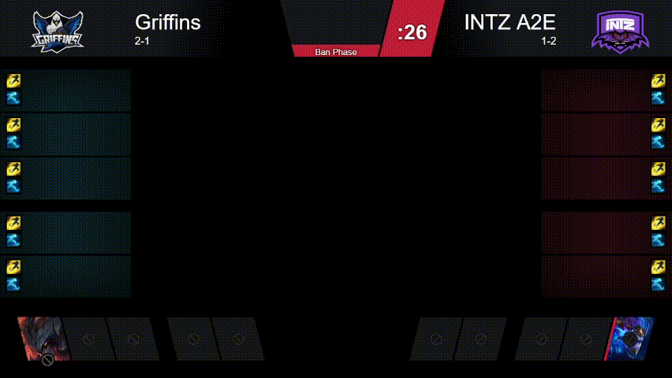
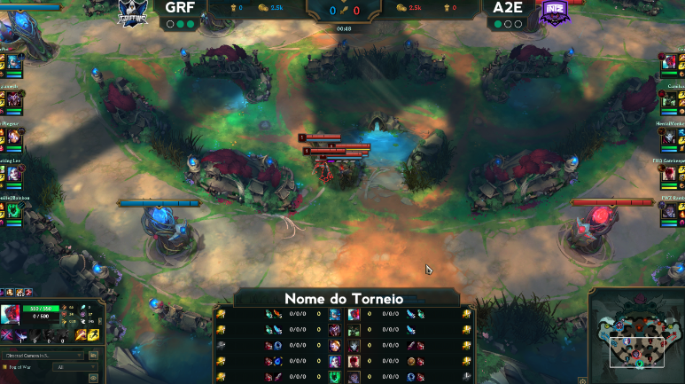

# Front-End - Stream Overlay

Fron-end de um projeto para criação de overlays para campeonatos de LoL. 
É uma dashboard para configuração do campeonato, e as respectivas telas para serem adicionadas como fonte no OBS Studio.

[Back-End do projeto](https://github.com/laisgarc/backend-stream)

## Como usar

⚠️ **Antes de iniciar o front, certifique-se de que o Back-End já está rodando** ⚠️

Para iniciar o front-end basta rodar
` npm start `
Ele estará rodando na porta 3000. Então, adicione o link para cada tela como uma fonte de browser no OBS Studio.

### Telas

#### Dashboard
`/`
É onde acontece a configuração do campeonato, assim como de seus respectivos times.


#### Matchup
`/Matchup`
Imagem de ambos os times, assim como suas pontuações no campeonato. Possui fundo transparente, para maior personalização no OBS Studio.


#### Picks and Bans
`/Picks`
Essa tela mostra toda a animação dos picks and bans. Caso o back-end esteja conectado com o Client do LoL, e os dados sejam de partidas reais - e não de um JSON de exemplo, como no caso do GIF abaixo - aparecerão também os nicks dos jogadores.


#### Spectator
`/LeagueOverlay`
Overlay mostrando logo, e pontuações dos times, assim como o nome do torneio. Possui fundo transparente, então abaixo dele na cena no OBS deve estar a sua tela do LoL.


### Configurando com o Back-End
Para que o servidor possa rodar corretamente com o front-end, o diretório deve seguir esse formato:
```
projeto
└───back-end
│   │ repositório do back-end
│
└───overlays
    │   este repositório
```


## To-Do
- [ ] Adicionar tela de casters
- [ ] Conectar OBS
- [ ] Adicionar banner dos patrocinadores